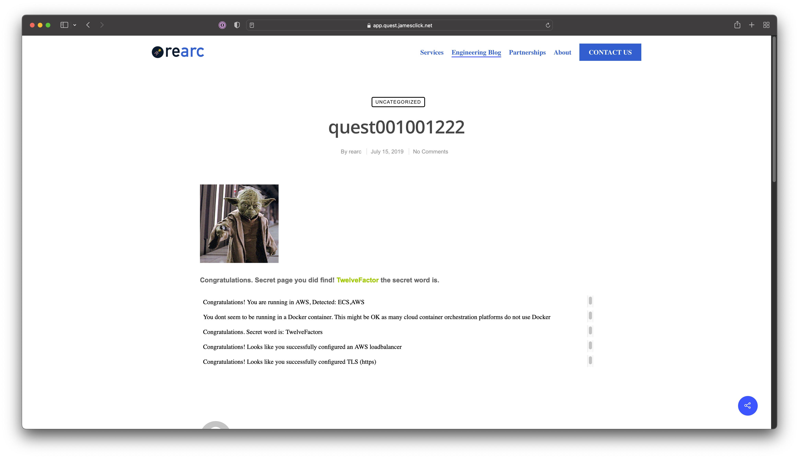

# A quest in the clouds

### Submitted Assets
 - Repo: [https://github.com/JamesClick/quest/](https://github.com/JamesClick/quest/) (IaC is under `aws-infra/` subdir)
 - Hosted Quest Webapp: [https://app.quest.jamesclick.net/](https://app.quest.jamesclick.net/)
 - Screenshot of hosted Quest webapp: 
  - Given more time, I would improve:
    - Testing (or lack thereof), for both the webapp and the CDK Stack. For production use, both unit and behavioral testing is essential to an effective deployment of CDK for IaC. Catching simple formatting errors to logically impossible stack updates, the use of local and continuous testing allow for quick, confident changes in multi-contributor envrionments. For this project, it was omitted mainly omitted due to time constraints and also the nature of how the webapp is built--utilizing blobs for the hosted logic and content.
    - Continuous testing/ deployment verification. Implementation of testing would also enable having testing present in deployment pipelines, something that I would always include where possible. It would also partially enable app-deployment verification, allowing for stronger pipeline reliability.
    - Future-proofing. Making the stack design resiliant to future changes is an important consideration. While it could be considered resiliant in it's current form, first thing that comes to mind would to genericize ARN and Account ID references (Both in CDK Context and infrastructure definition).
    - Utilization of Parameter Store or Secrets Manager for variable/ secrets management. This was omitted due to exess logistical overhead and time constraints.
    - Compute cluster configuration. Further definition of the cluster config (eg, defining instance types, creating a compute provision strategy for cost control) enables finer control of performance utilization costs.
