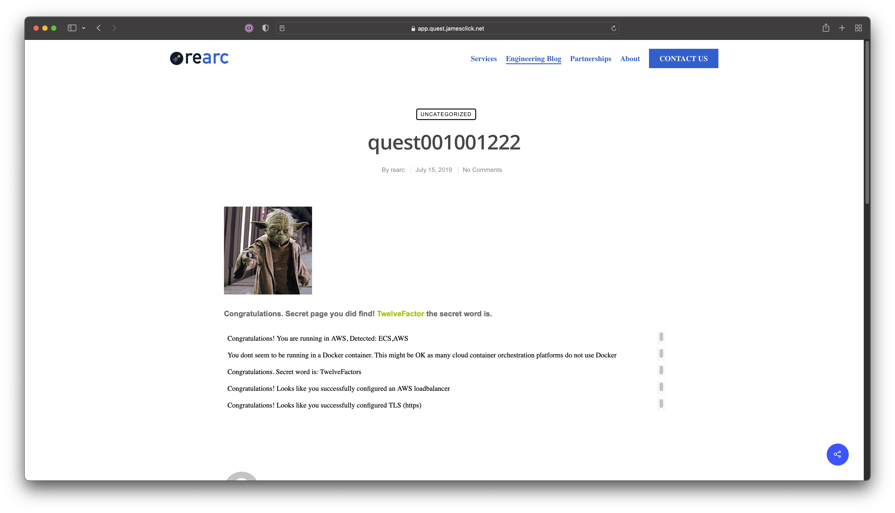

# A quest in the clouds

### Submitted Assets
 - Repo: [https://github.com/lastnameclick/quest/](https://github.com/lastnameclick/quest/) (IaC is under `aws-infra/` subdir)
 - Hosted Quest Webapp: [https://QuestA-Quest-9Hsswy5iJ53b-344333617.us-west-1.elb.amazonaws.com](https://QuestA-Quest-9Hsswy5iJ53b-344333617.us-west-1.elb.amazonaws.com)
 - Screenshot of hosted Quest webapp: 
  - Given more time, I would improve:
    - Testing (or lack thereof), for both the webapp and the CDK Stack. For production use, both unit and behavioral testing is essential to an effective deployment of CDK for IaC. Catching simple formatting errors to logically impossible stack updates, the use of local and continuous testing allow for quick, confident changes in multi-contributor envrionments. For this project, it was omitted mainly omitted due to time constraints and also the nature of how the webapp is built--utilizing blobs for the hosted logic and content.
    - Continuous testing/ deployment verification. Implementation of testing would also enable having testing present in deployment pipelines, something that I would always include where possible. It would also partially enable app-deployment verification, allowing for stronger pipeline reliability.
    - Future-proofing. Making the stack design resiliant to future changes is an important consideration. While it could be considered resiliant in it's current form, first thing that comes to mind would to genericize ARN and Account ID references (Both in CDK Context and infrastructure definition).
    - Compute cluster configuration. Further definition of the cluster config (eg, defining instance types, creating a compute provision strategy for cost control) enables finer control of performance utilization costs.
    - Automate certificate management. While it would be possible to run self-signed certificate creation and renewal from CDK, it wouldn't be considered "guaranteed" since it'll be using methods outside of the CDK library (which could cause issues at deployment). An alternative solution is to implement a Lambda that would invoke at CDK deploy time that checks if a valid certificate exists, and creates/renews said certificate if found invalid (this would also allow time-based renewal invokations).

### Known Issues
 - Selfsigned certificate generation is not automated (see below)
 - Initial deployment requires use of Docker Buildx when on ARM64 systems (see below)
 - Automated certificate renewal is not in place.
 - Webapp binary makes broken calls to analytics/pixel tracking services/webfonts

### Self-signed Certificate management
ELB will not generate a self-signed certificate. You must generate one locally then upload it to ACM.
```bash
# Generate Private Key if not already created:
openssl genrsa 2048 > privatekey.pem

# Request new certificate:
openssl req -new -x509 -nodes -sha256 -days 365 -key privatekey.pem -outform PEM -out amazonawsselfsigned.pem

# Upload new certificate to ACM. Returns CertificateArn for use in CDK stack:
aws acm import-certificate --certificate file://amazonawsselfsigned.pem --private-key file://privatekey.pem
```

### Initial Deployment on ARM
_Tested on Apple Silicon, unsure if Windows On Arm utilizes the same commands._

Containers built with `linux/arm64` systems are not supported on AWS Fargate, which is used by Quest for Web.
r
Workaround: First setup Docker Buildx to your liking, being sure to include a `linux/amd64` option. Set the Envrionment Vaiable to use that container type. This is not an issue for the stack pipeline post inital deployment.
```bash
export DOCKER_DEFAULT_PLATFORM='linux/amd64'
``` 